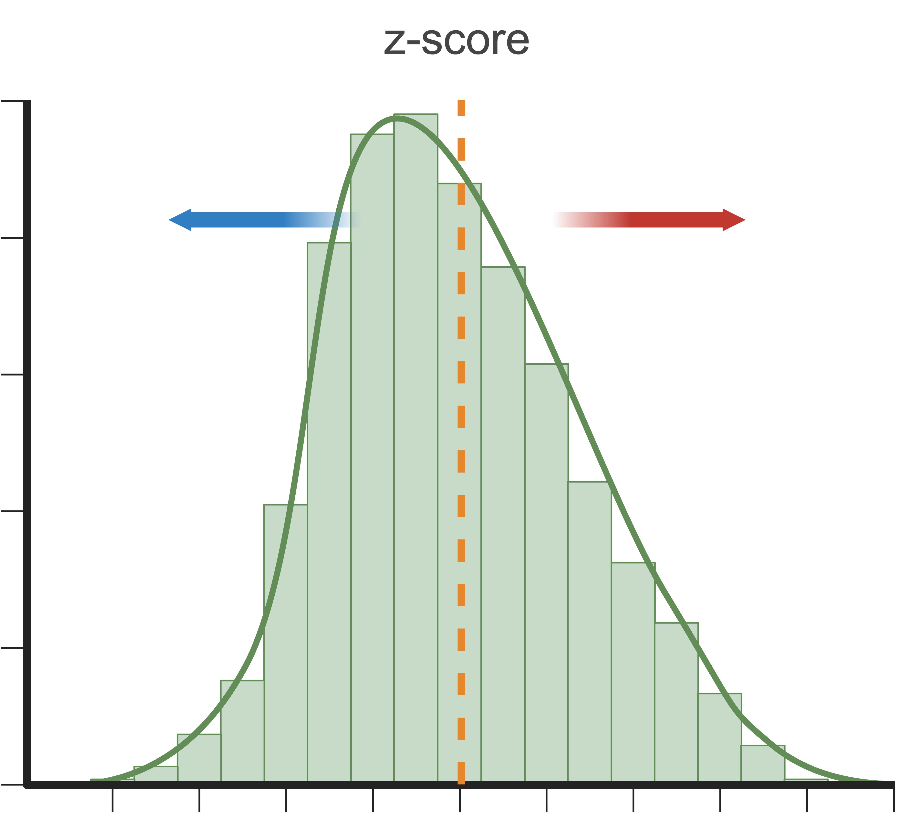

### Topics in this notebook:

-   PCA, tSNE, and UMAP

-   Understanding UMAP and tSNE parameters and their effects

-   Different starting points for calculating UMAP

## Data preparation

First, let's load all necessary libraries and the QC-filtered dataset from the previous step.

```{r libPaths}
#.libPaths("/shared/projects/tp_2616_fnom_183960/conda/envs/PP_r_test/lib/R/library")
.libPaths(c("/shared/projects/tp_2616_fnom_183960/conda/envs/PP_r_env_all/lib/R/library",
          "/shared/home/tp184323/R/x86_64-conda-linux-gnu-library/4.5"))

```

```{r libraries}
suppressPackageStartupMessages({
    library(Seurat)
    library(ggplot2) # plotting
    library(patchwork) # combining figures
    library(scran)
    library(scater)
})
```

```{r fetch-data}
getwd()
path_file <- "../../../day1/1_QualityControl/data/covid/results/seurat_covid_qc.rds"
alldata <- readRDS(path_file)
```

## Feature selection

We first need to define which features/genes are important in our dataset to distinguish cell types. For this purpose, we need to find genes that are highly variable across cells, which in turn will also provide a good separation of the cell clusters.

```{r hvg}
suppressWarnings(suppressMessages(alldata <- FindVariableFeatures(alldata, selection.method = "vst", nfeatures = 2000, verbose = FALSE, assay = "RNA")))
top20 <- head(VariableFeatures(alldata), 20)

LabelPoints(plot = VariableFeaturePlot(alldata), points = top20, repel = TRUE)
```

## Z-score transformation

Now that the genes have been selected, we now proceed with PCA. Since each gene has a different expression level, it means that genes with higher expression values will naturally have higher variation that will be captured by PCA. This means that we need to somehow give each gene a similar weight when performing PCA (see below). The common practice is to center and scale each gene before performing PCA. This exact scaling called Z-score normalization is very useful for PCA, clustering and plotting heatmaps.



Additionally, we can use regression to remove any unwanted sources of variation from the dataset, such as `cell cycle`, `sequencing depth`, `percent mitochondria` etc. This is achieved by doing a generalized linear regression using these parameters as co-variates in the model. Then the residuals of the model are taken as the *regressed data*. Although perhaps not in the best way, batch effect regression can also be done here. By default, variables are scaled in the PCA step and is not done separately. But it could be achieved by running the commands below:

```{r scale}
alldata <- ScaleData(alldata, vars.to.regress = c("percent_mito", "nFeature_RNA"), assay = "RNA")
```

## PCA

Performing PCA has many useful applications and interpretations, which much depends on the data used. In the case of single-cell data, we want to segregate samples based on gene expression patterns in the data.

To run PCA, you can use the function `RunPCA()`.

```{r pca}
alldata <- RunPCA(alldata, npcs = 50, verbose = F)
```

We then plot the first principal components.

```{r pca-plot, fig.width=12, fig.height=4}
wrap_plots(
    DimPlot(alldata, reduction = "pca", group.by = "orig.ident", dims = 1:2),
    DimPlot(alldata, reduction = "pca", group.by = "orig.ident", dims = 3:4),
    DimPlot(alldata, reduction = "pca", group.by = "orig.ident", dims = 5:6),
    ncol = 3
) + plot_layout(guides = "collect")
```

To identify which genes (Seurat) or metadata parameters (Scater/Scran) contribute the most to each PC, one can retrieve the loading matrix information. Unfortunately, this is not implemented in Scater/Scran, so you will need to compute PCA using `logcounts`.

```{r pca-loadings, fig.height=6, fig.width=14}
VizDimLoadings(alldata, dims = 1:5, reduction = "pca", ncol = 5, balanced = T)
```

We can also plot the amount of variance explained by each PC.

```{r pca-elbow, fig.height=4, fig.width=5}
ElbowPlot(alldata, reduction = "pca", ndims = 50)
```

Based on this plot, we can see that the top 8 PCs retain a lot of information, while other PCs contain progressively less. However, it is still advisable to use more PCs since they might contain information about rare cell types (such as platelets and DCs in this dataset).

With the `scater` package we can check how different metadata variables contribute to each PC. This can be important to look at to understand different biases you may have in your data.

```{r pca-explanatory, fig.height=4, fig.width=10}
scater::plotExplanatoryPCs(as.SingleCellExperiment(alldata), nvars_to_plot = 15, npcs_to_plot = 20)
```

::: {#task1 .callout-tip}
##### Discuss

Have a look at the `plotExplanatoryPCs` plot and the gene loadings. Do you think the top components are biologically relevant or more driven by technical noise?
:::

## tSNE

We will now run [BH-tSNE](https://arxiv.org/abs/1301.3342) - a very efficient implementation of tSNE.

```{r run-tsne}
alldata <- RunTSNE(
    alldata,
    reduction = "pca", dims = 1:30,
    perplexity = 30,
    max_iter = 1000,
    theta = 0.5,
    eta = 200,
    num_threads = 0
)
# see ?Rtsne and ?RunTSNE for more info
```

We plot the tSNE scatterplot colored by dataset. We can clearly see the effect of batches present in the dataset.

```{r plot-tsne, fig.height=5, fig.width=6}
DimPlot(alldata, reduction = "tsne", group.by = "orig.ident")
```

## UMAP

We can now run [UMAP](https://arxiv.org/abs/1802.03426) for cell embeddings.

```{r run-umap}
alldata <- RunUMAP(
    alldata,
    reduction = "pca",
    dims = 1:30,
    n.components = 2,
    n.neighbors = 30,
    n.epochs = 200,
    min.dist = 0.3,
    learning.rate = 1,
    spread = 1
)
# see ?RunUMAP for more info
```

A feature of UMAP is that it is not limited by the number of dimensions the data can be reduced into (unlike tSNE). We can simply reduce the dimensions by altering the `n.components` parameter. So here we will create a UMAP with 10 dimensions.

In Seurat, we can add in additional reductions, by default they are named "pca", "umap", "tsne" etc. depending on the function you run. Here we will specify an alternative name for the umap with the `reduction.name` parameter.

```{r run-umap2}
alldata <- RunUMAP(
    alldata,
    reduction.name = "UMAP10_on_PCA",
    reduction = "pca",
    dims = 1:30,
    n.components = 10,
    n.neighbors = 30,
    n.epochs = 200,
    min.dist = 0.3,
    learning.rate = 1,
    spread = 1
)
# see ?RunUMAP for more info
```

UMAP is plotted colored per dataset. Although less distinct as in the tSNE, we still see quite an effect of the different batches in the data.

```{r plot-umap, fig.height=4, fig.width=12}
wrap_plots(
    DimPlot(alldata, reduction = "umap", group.by = "orig.ident") + ggplot2::ggtitle(label = "UMAP_on_PCA"),
    DimPlot(alldata, reduction = "UMAP10_on_PCA", group.by = "orig.ident", dims = 1:2) + ggplot2::ggtitle(label = "UMAP10_on_PCA"),
    DimPlot(alldata, reduction = "UMAP10_on_PCA", group.by = "orig.ident", dims = 3:4) + ggplot2::ggtitle(label = "UMAP10_on_PCA"),
    ncol = 3
) + plot_layout(guides = "collect")
```

We can now plot PCA, UMAP and tSNE side by side for comparison. Have a look at the UMAP and tSNE. What similarities/differences do you see? Can you explain the differences based on what you learned during the lecture? Also, we can conclude from the dimensionality reductions that our dataset contains a batch effect that needs to be corrected before proceeding to clustering and differential gene expression analysis.

```{r plot-dimred, fig.height=4, fig.width=12}
wrap_plots(
    DimPlot(alldata, reduction = "pca", group.by = "orig.ident"),
    DimPlot(alldata, reduction = "tsne", group.by = "orig.ident"),
    DimPlot(alldata, reduction = "umap", group.by = "orig.ident"),
    ncol = 3
) + plot_layout(guides = "collect")
```

::: {#task2 .callout-tip}
#### Task

We have now done Variable gene selection, PCA and UMAP with the settings we selected for you. Test a few different ways of selecting variable genes, the number of PCs for UMAP and check how it influences your embeddings. This website will give you a way to explore the effect of the different parameters for tSNE and UMAP more intuitively: [Understanding UMAP and tSNE](https://pair-code.github.io/understanding-umap/)
:::

::: {#Discuss2 .callout-tip}
##### Discuss

UMAP and tSNE have plenty of parameters to play around with, but how do you know which parameter combinations are actually good for your dataset? Is there a best combination, and if so, how do I define what's best? Is it important? Discuss with your neighbor.
:::

## Z-scores & DR graphs

Although running a second dimensionality reduction (i.e tSNE or UMAP) on PCA would be a standard approach (because running it on the already reduced dimensions allows for higher computational efficiency), the options are actually limitless. Below we will demonstrate a couple other common options such as running UMAP directly on the scaled data (z-scores) (which was also used for PCA) or on a graph built from scaled data. We will only work with UMAPs, but the same applies for tSNE.

### UMAP from z-scores

To run tSNE or UMAP on the scaled data, one first needs to select the number of variables to use. This is because including dimensions that do not contribute to the separation of your cell types will in the end mask those differences. Another reason for it is that running with all genes/features also will take longer or might be computationally unfeasible. Therefore, we will use the scaled data of the highly variable genes.

```{r run-umap-sd}
alldata <- RunUMAP(
    alldata,
    reduction.name = "UMAP_on_ScaledData",
    features = VariableFeatures(alldata),
    assay = "RNA",
    n.components = 2,
    n.neighbors = 30,
    n.epochs = 200,
    min.dist = 0.3,
    learning.rate = 1,
    spread = 1
)
```

### UMAP from graph

To run tSNE or UMAP on the a graph, we first need to build a graph from the data. In fact, both tSNE and UMAP first build a graph from the data using a specified distance matrix and then optimize the embedding. Since a graph is just a matrix containing distances from cell to cell, you can run either UMAP or tSNE using any other distance metric desired. Euclidean and Correlation are the most commonly used.

```{r umap-graph, eval=FALSE}
# Build Graph
alldata <- FindNeighbors(alldata,
    reduction = "pca",
    assay = "RNA",
    k.param = 20,
    features = VariableFeatures(alldata)
)

```

We can now plot the UMAPs and compare its cell embeddings computed from PCA vs ScaledData vs Graph.

```{r plot-umap-graph, fig.height=4, fig.width=12}
p1 <- DimPlot(alldata, reduction = "umap", group.by = "orig.ident") + ggplot2::ggtitle(label = "UMAP_on_PCA")
p2 <- DimPlot(alldata, reduction = "UMAP_on_ScaledData", group.by = "orig.ident") + ggplot2::ggtitle(label = "UMAP_on_ScaledData")
#p3 <- DimPlot(alldata, reduction = "UMAP_on_Graph", group.by = "orig.ident") + ggplot2::ggtitle(label = "UMAP_on_Graph")
#wrap_plots(p1, p2, p3, ncol = 3) + plot_layout(guides = "collect")
wrap_plots(p1, p2, ncol = 2) + plot_layout(guides = "collect")
```

## Plotting metrics onto the embeddings

Let's plot some marker genes for different cell types onto the embedding.

| Markers                  | Cell Type         |
|:-------------------------|:------------------|
| CD3E                     | T cells           |
| CD3E CD4                 | CD4+ T cells      |
| CD3E CD8A                | CD8+ T cells      |
| GNLY, NKG7               | NK cells          |
| MS4A1                    | B cells           |
| CD14, LYZ, CST3, MS4A7   | CD14+ Monocytes   |
| FCGR3A, LYZ, CST3, MS4A7 | FCGR3A+ Monocytes |
| FCER1A, CST3             | DCs               |

```{r plot-markers, fig.height=9, fig.width=12}

myfeatures <- c("CD3E", "CD4", "CD8A", "NKG7", "GNLY", "MS4A1", "CD14", "LYZ", "MS4A7", "FCGR3A", "CST3", "FCER1A")
FeaturePlot(alldata, reduction = "umap", dims = 1:2, features = myfeatures, ncol = 4, order = T)
```

::: {#task3 .callout-tip}
#### Task

Select some of your dimensionality reductions and color your cells by some of the QC stats that were calculated in the previous practical. Can you see if some variation in your data is driven by quality of the cells?
:::

## Save data

We can finally save the object for use in future steps.

```{r save}
path_results <- "/shared/projects/tp_2616_fnom_183960/Puigdevall_P/Cajal-scRNAseq-2026/day2/2_Dimensional_Reduction/data/covid/results/"
saveRDS(alldata, file.path(path_results, "seurat_covid_qc_dr.rds"))


```

::: {.callout-note collapse="true"}
## Session Info

```{r}

sessionInfo()

```
:::
