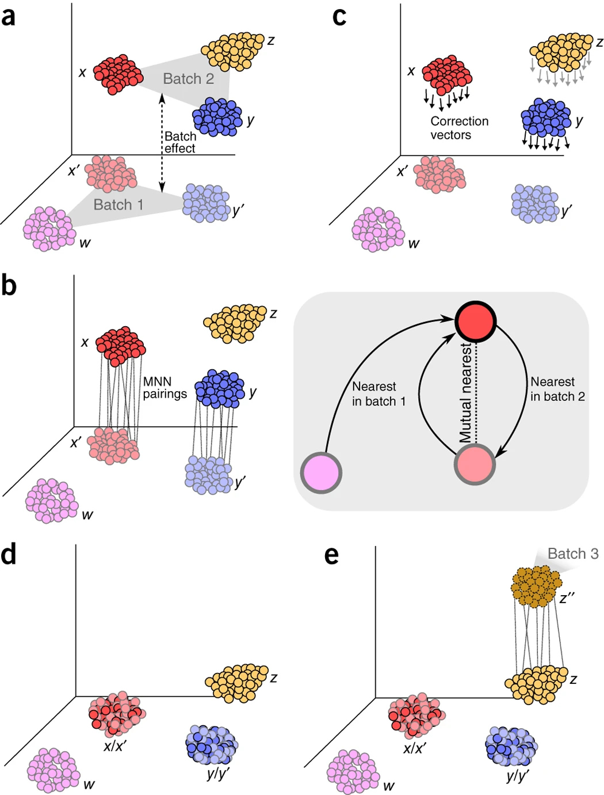

## Credits

**Original authors**
Åsa Björklund, Paulo Czarnewski, Susanne Reinsbach, Roy Francis

**Modified by**
Pau Puigdevall

## Description
Combining and harmonizing samples or datasets from different batches
such as experiments or conditions to enable meaningful cross-sample comparisons.

<div>

> **Note**
> This tutorial is originally part of the
> [NBIS single-cell RNA-seq course](https://nbisweden.github.io/workshop-scRNAseq/archive/2025/labs/seurat/seurat_03_integration.html).
> It has been adapted to run in the [Noppe learning environment](https://docs.csc.fi/cloud/noppe/).
> Code chunks run R commands unless otherwise specified.

</div>


In this tutorial we will look at different ways of integrating multiple
single cell RNA-seq datasets. We will explore a few different methods to
correct for batch effects across datasets. The Seurat toolkit enables us
to use different integration approaches, some presented in Comprehensive
Integration of Single Cell Data, while others are wrappers of methods 
developed outside the toolkit, such as FastMNN, Harmony or scVI. The latter
actually has its own probabilistic models for single-cell omics data integrated
with Scanpy. Below you can find a list of the methods that we will run today:

  -----------------------------------------------------------------------------------------------------------------------------------------------------------------------------------------
  Markdown          Language          Library           Ref
  ----------------- ----------------- ----------------- -----------------------------------------------------------------------------------------------------------------------------------
  CCA               R                 Seurat            [Cell](https://www.sciencedirect.com/science/article/pii/S0092867419305598?via%3Dihub)
  
  Harmony           R                 Harmony           [Nat. Methods](https://www.nature.com/articles/s41592-019-0619-0)
  
  FastMNN           R                 SeuratWrapper     [Nat. Biotechnology](https://www.nature.com/articles/s41587-023-01767-y)

  scVI              R/Python          Scanpy/Seurat     [Nat. Biotehnology](https://www.nature.com/articles/s41587-021-01206-w)

  -----------------------------------------------------------------------------------------------------------------------------------------------------------------------------------------

## Data preparation

Let's first load necessary libraries and the data saved in the previous lab.


```{r}
#.libPaths("/shared/projects/tp_2616_fnom_183960/conda/envs/PP_r_test/lib/R/library")
.libPaths(c("/shared/projects/tp_2616_fnom_183960/conda/envs/PP_r_env_all/lib/R/library",
          "/shared/home/tp184323/R/x86_64-conda-linux-gnu-library/4.5"))

```

``` {r libraries}

suppressPackageStartupMessages({
    library(Seurat)
    library(SeuratWrappers)
    library(SeuratData)
    library(SeuratDisk)
    library(ggplot2)
    library(patchwork)
    library(reticulate)
    library(harmony)
    library(batchelor)
})

```

``` {r fetch-data}
path_file <- "../../2_Dimensional_Reduction/data/covid/results/seurat_covid_qc_dr.rds"
alldata <- readRDS(path_file)

print(names(alldata@reductions))
```

With Seurat5 we can split the `RNA` assay into multiple `Layers` with
one count matrix and one data matrix per sample. When we then run
`FindVariableFeatures` on the object it will run it for each of the
samples separately, but also compute the overall variable features by
combining their ranks.

``` {r hvg, fig.height=10, fig.width=12}

# get the variable genes from all the datasets without batch information.
hvgs_old = VariableFeatures(alldata)

# now split the object into layers
alldata[["RNA"]] <- split(alldata[["RNA"]], f = alldata$orig.ident)

# detect HVGs
alldata <- FindVariableFeatures(alldata, selection.method = "vst", nfeatures = 2000, verbose = FALSE)

# to get the HVGs for each layer we have to fetch them individually
data.layers <- Layers(alldata)[grep("data.",Layers(alldata))]
print(data.layers)

hvgs_per_dataset <- lapply(data.layers, function(x){
  tmp <- alldata[,alldata$orig.ident==gsub("data.","",x)]
  tmp <- FindVariableFeatures(tmp)
  VariableFeatures(tmp)
})
names(hvgs_per_dataset) = data.layers

# also add in the variable genes that was selected on the whole dataset and the old ones 
hvgs_per_dataset$all <- VariableFeatures(alldata)
hvgs_per_dataset$old <- hvgs_old

temp <- unique(unlist(hvgs_per_dataset))
overlap <- sapply( hvgs_per_dataset , function(x) { temp %in% x } )
pheatmap::pheatmap(t(overlap*1),cluster_rows = F ,
                   color = c("grey90","grey20"))
```

As you can see, there are a lot of genes that are variable in just one
dataset. There are also some genes in the gene set that was selected
using all the data that are not variable in any of the individual
datasets. These are most likely genes driven by batch effects.

A better way to select features for integration is to combine the
information on variable genes across the dataset. This is what we have
in the `all` section where the ranks of the variable features in the
different datasets is combined.

<div>

> **Discuss**
>
> Did you understand the difference between running variable gene
> selection per dataset and combining them vs running it on all samples
> together. Can you think of any situation where it would be best to run
> it on all samples and a situation where it should be done by batch?

</div>

For all downstream integration, we will use this set of genes to ensure
comparability across methods. Before proceeding, we rerun `ScaleData` and `PCA` 
using only this gene set. In the scaling below, we
regress out the percentage of mitochondrial counts and
the number of genes (features) detected per cell.

Note that regressing out such variables is context-dependent: in other datasets, 
this step may be unnecessary or even counterproducive, depending on the biological
effects under investigation.


``` {r pca}
hvgs_all = hvgs_per_dataset$all

alldata = ScaleData(alldata, features = hvgs_all, vars.to.regress = c("percent_mito", "nFeature_RNA"))
alldata = RunPCA(alldata, features = hvgs_all, verbose = FALSE)
```

## CCA

In Seurat v4 we run the integration in two steps, first finding anchors
between datasets with `FindIntegrationAnchors()` and then running the
actual integration with `IntegrateData()`. Since Seurat v5 this is done
in a single command using the function `IntegrateLayers()`, we specify
the name for the integration as `integrated_cca`. If you set `verbose=TRUE`,
you'll see that CCA is an iterative process which aims to find a shared
low-dimensional space by identifying correlated gene expression patterns
across them. Their PCA are aligned based on the shared sources of variation,
and that process is than pairwise with merged or unmerged datasets


In CCA (image above), we typically align two matrices representing different datasets,
where both datasets have the same set of genes (they have been internally intersected)
but different numbers of cells. CCA is used to identify correlated structures across
the two datasets and align them in a common space.

``` {r run-cca} 
alldata <- IntegrateLayers(object = alldata, 
                           method = CCAIntegration, orig.reduction = "pca", 
                           new.reduction = "integrated_cca", verbose = TRUE)
```

We should now have a new dimensionality reduction slot
(`integrated_cca`) in the object:

``` {r reductions}
names(alldata@reductions)
```

Using this new integrated dimensionality reduction we can now run UMAP
and tSNE on that object, and we again specify the names of the new
reductions so that the old UMAP and tSNE are not overwritten.

``` {r proc-cca}
alldata <- RunUMAP(alldata, reduction = "integrated_cca", dims = 1:30, reduction.name = "umap_cca")
alldata <- RunTSNE(alldata, reduction = "integrated_cca", dims = 1:30, reduction.name = "tsne_cca")

names(alldata@reductions)
```

We can now plot the unintegrated and the integrated space reduced
dimensions.

``` {r plot-cca, fig.height=6, fig.width=10}

wrap_plots(
  DimPlot(alldata, reduction = "pca", group.by = "orig.ident")+NoAxes()+ggtitle("PCA raw_data"),
  DimPlot(alldata, reduction = "tsne", group.by = "orig.ident")+NoAxes()+ggtitle("tSNE raw_data"),
  DimPlot(alldata, reduction = "umap", group.by = "orig.ident")+NoAxes()+ggtitle("UMAP raw_data"),
  
  DimPlot(alldata, reduction = "integrated_cca", group.by = "orig.ident")+NoAxes()+ggtitle("CCA integrated"),
  DimPlot(alldata, reduction = "tsne_cca", group.by = "orig.ident")+NoAxes()+ggtitle("tSNE integrated"),
  DimPlot(alldata, reduction = "umap_cca", group.by = "orig.ident")+NoAxes()+ggtitle("UMAP integrated"),
  ncol = 3
) + plot_layout(guides = "collect")
```

### Marker genes

Let's plot some marker genes for different cell types onto the
embedding.

  Markers                    Cell Type
  -------------------------- -------------------
  CD3E                       T cells
  CD3E CD4                   CD4+ T cells
  CD3E CD8A                  CD8+ T cells
  GNLY, NKG7                 NK cells
  MS4A1                      B cells
  CD14, LYZ, CST3, MS4A7     CD14+ Monocytes
  FCGR3A, LYZ, CST3, MS4A7   FCGR3A+ Monocytes
  FCER1A, CST3               DCs

``` {r plot-markers, fig.height=8, fig.width=10}

myfeatures <- c("CD3E", "CD4", "CD8A", "NKG7", "GNLY", "MS4A1", "CD14", "LYZ", "MS4A7", "FCGR3A", "CST3", "FCER1A")
FeaturePlot(alldata, reduction = "umap_cca", dims = 1:2, features = myfeatures, ncol = 4, order = T) + NoLegend() + NoAxes() + NoGrid()
```

## Harmony

CCA and Harmony are both batch-correction / data-integration methods, but they are based on very different assumptions,
and behave differently in practice. CCA finds shared correlated gene expression signatures
between datasets and aligns them in a common space. Instead, Harmony adjusts an existing low-dimensional embedding (ie. PCA)
to remove batch effects while preserving the biological structure. So rather than building a shared space, Harmony fixes an existing space.
More technically, Harmony computes a PCA on combined data, and then for each PC, it models the "batch-to-correct" as a covariate. 

Iteratively, it then clusters cells and adjusts PC coordinates to reduce batch dependence. It stops when batch mixing is maximized without
destroying the PCA structure. This approach makes Harmony much faster and scalable to millions of cells and, under proper experimental design, it can 
keep true biological differences even with the presence of batch effects.


Note that Harmony output does not correct the expression space, but it provides a batch-corrected dimensional space (usually batch-corrected PCA).

For more details on the method, please se their paper [Nat.Methods](https://www.nature.com/articles/s41592-019-0619-0).
The method below runs the integration on a dimensionality reduction, in most applications
the PCA. So first, we prefer to have scaling and PCA with the same set
of genes that were used for the CCA integration, which we ran earlier.

We can use the same function `IntegrateLayers()` but instead specify
the method `HarmonyIntegration`. And as above, we run UMAP on the new
reduction from Harmony.

``` {r harmony, fig.height=8, fig.width=10}

alldata <- IntegrateLayers(
  object = alldata, method = HarmonyIntegration,
  orig.reduction = "pca", new.reduction = "harmony",
  verbose = FALSE
)


alldata <- RunUMAP(alldata, dims = 1:30, reduction = "harmony", reduction.name = "umap_harmony")
DimPlot(alldata, reduction = "umap_harmony", group.by = "orig.ident") + NoAxes() + ggtitle("Harmony UMAP")
```

## FastMNN

Another integration method is FastMNN, which is conceptually closer to CCA than to Harmony.
FastMNN aligns datasets by finding mutual nearest neighbors (MNN) across batches
and correcting expression values locally, rather than learning a global shared space.

FastMNN performs a first step of dimensionalify reduction reductions for each batch using the highly variable genes.
Then, batches are integrated sequentially, using MNN. This means that for a cell in batch B, we will find its nearest neighbors in batch A,
and check whether the reverse is also true. If that is the case, these pairs represent the same biological state across batches.
Once all MNN pairs are identified, a correction vector is calculated for each of them, which is locally applied to shift cells in batch B
toward batch A.



This method provides a conservative correction (rare cell types are preserved) and it assumes local batch effects.
As a limitation, it requires overlaps between batches to integrate them, and it scales to dataset size similarly to CCA. Their best-use 
case is when attempting to integrate datasets that present subtle differences.

The `Seurat` wrapper for FastMNN uses the `batchelor` package. It returns a corrected new low-dimensional embedding,
and a batch-corrected expression assay, just for the highly-variable features.


``` {r fastmnn, fig.height=8, fig.width=10}

alldata <- IntegrateLayers(
  object = alldata, method = FastMNNIntegration,
  new.reduction = "integrated.mnn",
  verbose = FALSE
)

alldata <- RunUMAP(alldata, dims = 1:30, reduction = "integrated.mnn", reduction.name = "umap_fastmnn")
DimPlot(alldata, reduction = "umap_fastmnn", group.by = "orig.ident") + NoAxes() + ggtitle("FastMNN UMAP")
```

``` {r fastmnn2}
alldata@assays
```


## scVI (deep generative model)

CCA, FastMNN and Harmony are all integration methods that use alignment to a certain degree, while scVI (single-cell Variational Inference) is a deep generative model. The model integrates single-cell data by learning a batch-corrected latent space that explicitly separates biological signal from technical variation. So, rather than correcting the expression values, it learns from them.

scVI models the counts using a probabilistic framework: gene counts are noisy samples that contains an underlying biological state and technical effects. A neural network can learn to separate biology from technical noise, and for that purpose it uses a variational autoencoder (VAE). This VAE works first as an encoder that maps cells to a low-dimensional latent space, and then as a decoder, by reconstructing gene counts from latent variables and batch labels. The default output from scVI is a latent embedding.

The best-use case scenario for scVI are the integration of large-scale datasets, and that it can handle complex batch structures. 


scVI is implemented in Python with the package `scvi-tools`. Although `Seurat` has a wrapper to run it as an additional integration method,it still requires a local conda environment. To overcome this, we have created a Jupyter Notebook to showcase its implementation with our COVID dataset. Note that scVI is one of the most used methods nowadays for integration. Additionally, we will also benchmark the different integrations using the package `scib-metrics`. For this purpose, below we extract the dimensional reduction embeddings of CCA, Harmony and FastMNN to be read in python.


``` {r savedimred}

## The SeuratDisk version was working for R version 4.4.2, so it would be need to be run externally with this version. Left here as an example: package needs to be updated as an internal function was defunct.

alldata_to_h5ad <- alldata
alldata_to_h5ad <- JoinLayers(alldata_to_h5ad)
alldata_to_h5ad@assays$mnn.reconstructed <- NULL
alldata_to_h5ad@assays$RNA["scale.data"] <- NULL
alldata_to_h5ad@assays$RNA["data"] <- alldata_to_h5ad@assays$RNA["counts"]
DefaultAssay(alldata_to_h5ad) <- "RNA"

alldata_to_h5ad[["RNA3"]] <- as(object = alldata_to_h5ad[["RNA"]], Class = "Assay")
alldata_to_h5ad[["RNA"]] <- alldata_to_h5ad[["RNA3"]]
alldata_to_h5ad[["RNA3"]] <- NULL
print(getwd())

saveRDS(alldata_to_h5ad, "../data/covid/results/seurat_covid_to_be_exported_h5ad.rds")

# ## By default, "h5ad" file already exists in the repository. We force to overwrite it with the conversion.
# system("sbatch p3_export_to_h5ad.sh")
# SaveH5Seurat(alldata_to_h5ad, filename = "../data/covid/results/alldata.h5Seurat", overwrite = T)
# Convert("../data/covid/results/alldata.h5Seurat", dest = "h5ad", overwrite = F)

```


<div>

> **Run the Jupyter Notebook**
>
> Before proceeding to the next chunk, run the Jupyter Notebook of practical_3.
> After that, we can visualize the UMAP of the scVI integration. 
> In the notebook, we will also benchmark the different integration methods.

</div>


In order to show all the dimensional reductions together, we include the scVI latent embeddings below, and we also calculate the UMAP.

``` {r scvi, fig.height=8, fig.width=10}

scvi_embeddings <- read.csv("../data/covid/results/scvi_model/embeddings_scVI.csv")
rownames(scvi_embeddings) <- scvi_embeddings$X
scvi_embeddings$X <- NULL
stopifnot(all(rownames(scvi_embeddings)==colnames(alldata)))

## Include latent space from scVI
scvi_reduction <- CreateDimReducObject(
  embeddings = as.matrix(scvi_embeddings),
  key = "scVI_",
  assay = DefaultAssay(alldata)
)

alldata@reductions$X_scvi <- scvi_reduction

## Calculate UMAP
alldata <- RunUMAP(alldata, dims = 1:10, reduction = "X_scvi", reduction.name = "umap_scvi")
DimPlot(alldata, reduction = "umap_scvi", group.by = "orig.ident") + NoAxes() + ggtitle("scVI UMAP")
```


## Overview all methods

Now we will plot UMAPS with all three integration methods side by side.

``` {r plot-all, fig.height=8, fig.width=10}

p1 <- DimPlot(alldata, reduction = "umap", group.by = "orig.ident") + ggtitle("UMAP raw_data")
p2 <- DimPlot(alldata, reduction = "umap_cca", group.by = "orig.ident") + ggtitle("UMAP CCA")
p3 <- DimPlot(alldata, reduction = "umap_harmony", group.by = "orig.ident") + ggtitle("UMAP Harmony")
p4 <- DimPlot(alldata, reduction = "umap_fastmnn", group.by = "orig.ident") + ggtitle("UMAP FastMNN")
p5 <- DimPlot(alldata, reduction = "umap_scvi", group.by = "orig.ident")+ggtitle("UMAP scVI")

wrap_plots(p1, p2, p3, p4, p5, ncol = 3) + plot_layout(guides = "collect")
```

<div>

> **Discuss**
>
> Look at the different integration results, which one do you think
> looks the best? How would you motivate selecting one method over the
> other after this and the benchmarking? How do you think you could best 
> evaluate if the integration worked well?

</div>


Let's save the integrated data for further analysis.

``` {r save}
getwd()
saveRDS(alldata,"../data/covid/results/seurat_covid_qc_dr_int.rds")
```

## Extra task

You have now done the Seurat integration with CCA which is quite slow.
There are other options in the `IntegrateLayers()` function. Try
rerunning the integration with `RPCAIntegration` and create a new UMAP.
Compare the results.

## Session info


``` {r session}
sessionInfo()
```
