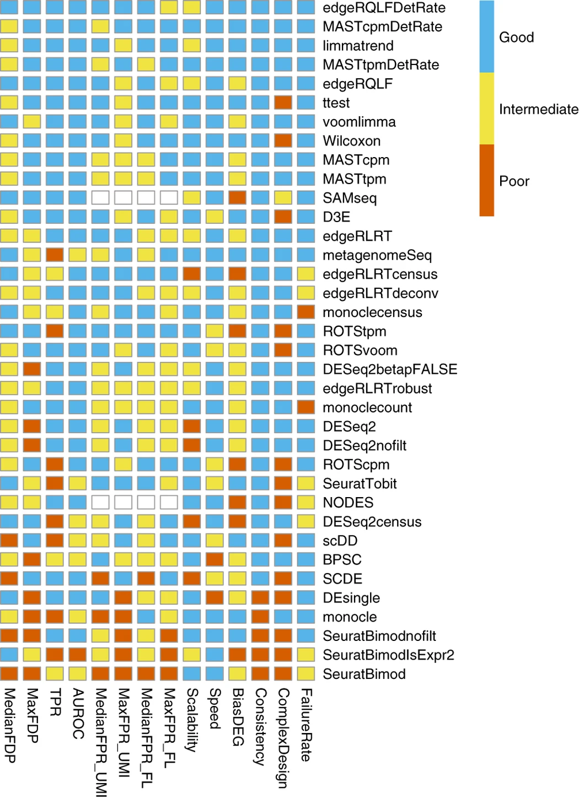

## Credits

**Original authors**
Åsa Björklund, Paulo Czarnewski, Susanne Reinsbach, Roy Francis

**Modified by**
Pau Puigdevall, Matias M. Falco

## Description
Identify genes that are significantly over or under-expressed between conditions in specific cell populations.

<div>

> **Note**
> This tutorial is originally part of the
> [NBIS single-cell RNA-seq course](https://nbisweden.github.io/workshop-scRNAseq/archive/2025/labs/seurat/seurat_05_dge.html).
> It has been adapted to run in the [Noppe learning environment](https://docs.csc.fi/cloud/noppe/).
> Code chunks run R commands unless otherwise specified.

</div>

In this tutorial, we will cover differential gene expression,
a broad class of methods with many applications. In single cell data,
differential expression (DE) is used to identify marker genes for 
specific cell populations and to dissect gene dysregulation across 
conditions (ie., cases vs controls). We also consider how to control
for batch effects while running differential gene expression.

To start, we first load the data from the previous clustering session.


```{r}
.libPaths(c("/shared/projects/tp_2616_fnom_183960/conda/envs/PP_r_env_all/lib/R/library",
          "/shared/home/tp184323/R/x86_64-conda-linux-gnu-library/4.5"))

```


``` {r libraries}
suppressPackageStartupMessages({
    library(Seurat)
    library(dplyr)
    library(patchwork)
    library(ggplot2)
    library(pheatmap)
    library(enrichR)
    library(Matrix)
    library(edgeR)
    library(MAST)
    library(gghighlight)
})
```

``` {r fetch-data}

path_file <- "../../../day2/4_Clustering/data/covid/results/seurat_covid_qc_dr_int_cl.rds"

alldata <- readRDS(path_file)

alldata

```

We then set the `louvain` clustering with a resolution=0.5 for the downstream analysis.

``` {r select-cl}

# Set the identity as louvain with resolution 0.5
sel.clust <- "RNA_snn_res.0.5"

alldata <- SetIdent(alldata, value = sel.clust)
table(alldata@active.ident)
```

The plots below show the UMAP embeddings after CCA integration, coloring the cells based on the i) the clustering , ii) the 10x libraries and iii) the condition.

``` {r plot-data, fig.height=5, fig.width=12}
# plot this clustering
wrap_plots(
    DimPlot(alldata, reduction = "umap_cca", label = T) + NoAxes(),
    DimPlot(alldata, reduction = "umap_cca", group.by = "orig.ident") + NoAxes(),
    DimPlot(alldata, reduction = "umap_cca", group.by = "type") + NoAxes(),
    ncol = 3
)
```

Another way to visualize the cells with a reduced overlap between the different groupings is to show one of the categories at a time with `gghighlight`package.

``` {r plot-data-detailed, fig.height=4, fig.width=8}
DimPlot(alldata, reduction = "umap_cca", group.by = "type", raster = F)+NoAxes()+
  facet_wrap(~type)+gghighlight()
```
## Cell marker genes

One of the first steps for annotating cell populations, is to compute a ranking of the most 
upregulated DE genes per cluster. There are many different tests and parameters
to be chosen that can optimise your results. When looking for marker genes, we
want genes that are cell type-specific, so that are positively expressed in a
cell type and possibly not expressed in others.

It is important to consider which assay to be used previous to DE. With
the default Seurat functions, we will use the RNA assays, and in particular,
the log-normalised counts in the `data` slot. Be aware that with Seurat v5,
the data might be split into different sample layers by default. For this reason,
it is recommended to first check what is in our object:


``` {r layers}
Layers(alldata@assays$RNA)
```

As you can see, we have the data split by each sample, so we need to
merge them into one single matrix to run the differential expression.
Note: This step can require a high volume of memory for datasets with
large number of cells.

``` {r join-layers1}
alldata@active.assay = "RNA"
alldata <- JoinLayers(object = alldata, layers = c("data","counts"))

Layers(alldata@assays$RNA)
```
We also inspect the dimensions of the merged layers. Do each of the layers contain raw counts, log-normalised counts and scaled counts as expected?
What do the "dots" in the matrix show?

``` {r join-layers2}
dim(alldata@assays$RNA["counts"])
alldata@assays$RNA["counts"][1:5,1:5]
dim(alldata@assays$RNA["data"])
alldata@assays$RNA["data"][1:5,1:5]
dim(alldata@assays$RNA["scale.data"])
alldata@assays$RNA["scale.data"][1:5,1:5]


```

Now we can run the function `FindAllMarkers` that will run a differential
expression test between each specific cluster and the rest of cells.
As you can see, there are some filtering criteria to remove genes
from the `data.frame` in the output (genes under a certain log2FC, 
percent expressed in the cluster, the difference on the percent expressed
between the two compared groups, or the number of cells considered).
Here we only show the upregulated genes, by setting the `only.pos` parameter
to `TRUE`.

The default test uses a Wilcoxon Rank Sum test, `test.use`=`wilcox`.

``` {r find-markers}

# Compute differential expression
markers_genes <- FindAllMarkers(
    alldata,
    logfc.threshold = 0.2,
    test.use = "wilcox",
    min.pct = 0.1,
    min.diff.pct = 0.2,
    only.pos = TRUE,
    max.cells.per.ident = 50,
    assay = "RNA"
)

head(markers_genes)
```
<div>

> **Question**
>
> Which parameters would you modify if you wanted to get the DE results from all genes?
>
> For simplicity, marker genes were selected just based on corrected p-value. Do you think that should be the only criteria?
> Which other columns from the DGE results would you also consider?
>
</div>


Alternatively, we can now select the top 25 upregulated genes (ordered by adjusted p-value).
Be aware that the resulting object from the chunk below is a tibble, not a data frame.


``` {r filter-markers}

top25 <- markers_genes %>%
    group_by(cluster) %>%
    top_n(-25, p_val_adj) %>% 
    # In case of tied p-values, further select the top 25 genes by fold-change
    top_n(25, avg_log2FC)

head(top25)
```
We can visualize the top-25 upregulated genes per cluster in the figure below:

``` {r barplot-markers, fig.height=10, fig.width=7}

par(mfrow = c(2, 5), mar = c(4, 6, 3, 1))
for (i in unique(top25$cluster)) {
    barplot(sort(setNames(top25$avg_log2FC, top25$gene)[top25$cluster == i], F),
        horiz = T, las = 1, main = paste0(i, " vs. others"), border = "white", yaxs = "i"
    )
    abline(v = c(0, 0.25), lty = c(1, 2))
}
```

We can also visualize them as a heatmap (only the top-5 in the plot below).
This visualizations helps us to assess how cell type-specific are the identified DE genes.

``` {r heatmap-markers, fig.height=8, fig.width=8}

markers_genes %>%
    group_by(cluster) %>%
    slice_min(p_val_adj, n = 5, with_ties = FALSE) -> top5
# create a scale.data slot for the selected genes
alldata <- ScaleData(alldata, features = as.character(unique(top5$gene)), assay = "RNA")
DoHeatmap(alldata, features = as.character(unique(top5$gene)), group.by = sel.clust, assay = "RNA")

```

Another way is by representing the overall group expression and
detection rates in a dot-plot. Note that the average expression that is shown
in the plot corresponds to scaled expression across the different clusters, not across
individual cells. Also, the percent expressed (dot size), corresponds to the fraction 
of cells in the group with expression > 0. We recommend to add a gradient color scale to better
perceive the average scaled expression.

``` {r dotplot-marker, fig.height=10, fig.width=6}

DotPlot(alldata, features = rev(as.character(unique(top5$gene))), group.by = sel.clust, assay = "RNA") + coord_flip()+
  scale_color_gradient2(low="blue",  mid = "white", high="red")
```

We can also plot a violin plot for each gene. For simplicity, we just took the top-3 genes per cluster.

``` {r vlnplot-marker, fig.height=10, fig.width=10}

# take top 3 genes per cluster/
top5 %>%
    group_by(cluster) %>%
    top_n(-3, p_val) -> top3

# set pt.size to zero if you do not want all the points to hide the violin shapes, or to a small value like 0.1
VlnPlot(alldata, features = as.character(unique(top3$gene)), ncol = 5, group.by = sel.clust, assay = "RNA", pt.size = 0)
```

<div>

> **Discuss**
>
> Take a screenshot of those results and re-run the same code above with
> another test that is not "wilcox" (Wilcoxon Rank Sum test). Other
> possible tests are: "bimod" (Likelihood-ratio test), "roc" (Identifies 'markers' of gene
> expression using ROC analysis),"t" (Student's t-test),"negbinom"
> (negative binomial generalized linear model),"poisson" (poisson
> generalized linear model), "LR" (logistic regression), "MAST" (hurdle
> model), "DESeq2" (negative binomial distribution).

</div>

There is still not consensus on the best statistical test for differential
gene expression. Instead of one-size-fits-all solution, the choice of method
often depends on the biological question. The paper below benchmarks multiple approaches and
shows that many bulk RNA-seq methods remain competitive for single-cell data.

[Benchmarking paper](https://doi.org/10.1038/nmeth.4612)




In addition to using different statistical tests, we can adopt 
alternative strategies to assess the robustness of candidate cell type markers, for example
by downsampling the number of cells to obtain more balanced groups in DE tests.

### DGE with equal amount of cells

As seen before, the number of cells per cluster differ quite a bit in this data

``` {r ident}
table(alldata@active.ident)
```

Hence, when we run `FindAllMarkers` one cluster vs rest, the largest
cluster (cluster 0) might dominate the "rest" and bias the results.
So it is often a good idea to subsample the clusters to an
equal number of cells before running differential expression between
a large cluster and the rest. We can select a fixed number of cells 
per cluster with the function `WhichCells` and the argument `downsample`.

Obviously, those clusters with less cells than the `downsample` threshold are not affected by this step.

``` {r subsample}
sub <- subset(alldata, cells = WhichCells(alldata, downsample = 300))
table(sub@active.ident)
```

Now rerun `FindAllMarkers` with this set and compare the results.

``` {r find-marker-sub}
markers_genes_sub <- FindAllMarkers(
    sub,
    logfc.threshold = 0.2,
    test.use = "wilcox",
    min.pct = 0.1,
    min.diff.pct = 0.2,
    only.pos = TRUE,
    max.cells.per.ident = 50,
    assay = "RNA"
)
```

The number of significant genes per cluster has changed, with more for
some clusters and less for others given the different statistical power.

``` {r count-markers}
table(markers_genes$cluster)
table(markers_genes_sub$cluster)
```

We can again inspect the breadth and amplitude of expression of the top-5 markers.
Have the marker genes changed significantly for any of the clusters?

``` {r dotplot-marker-sub, fig.height=10, fig.width=6}

markers_genes_sub %>%
    group_by(cluster) %>%
    slice_min(p_val_adj, n = 5, with_ties = FALSE) -> top5_sub

DotPlot(alldata, features = rev(as.character(unique(top5_sub$gene))), group.by = sel.clust, assay = "RNA") + coord_flip() +
  scale_color_gradient2(low="blue",  mid = "white", high="red")
```

## DGE across conditions

The second way of computing differential expression is to answer which
genes are differentially expressed within a cluster, comparing cells from different
conditions: ie. comparing cells profiled in patients versus control samples.
By doing that, we can capture the expression signature of disease within a cluster,
although some cell type identities might be exclusively seen in one of the conditions.
Under this situation, we should not attempt to run DGE.

To showcase DGE across conditions, we will first subset our dataset by the cluster of interest
(cluster 3), and then set the cell identities (Seurat default DGE variable of comparison) to **type**,
which in our case corresponds to the metadata column for annotating Covid or control samples.


``` {r markers-subset}

# select all cells in cluster 3
cell_selection <- subset(alldata, cells = colnames(alldata)[alldata@meta.data[, sel.clust] == 3])
cell_selection <- SetIdent(cell_selection, value = "type")
# Compute differentiall expression
DGE_cell_selection <- FindAllMarkers(cell_selection,
    logfc.threshold = 0.2,
    test.use = "wilcox",
    min.pct = 0.1,
    min.diff.pct = 0.2,
    only.pos = TRUE,
    max.cells.per.ident = 50,
    assay = "RNA"
)
```

We can now plot the expression across the **type**. How should we interpret the violin plots below? Why some of them seem to be missing?


``` {r vlnplot-marker-subset, fig.height=6, fig.width=8}

DGE_cell_selection %>%
    group_by(cluster) %>%
    top_n(-5, p_val) -> top5_cell_selection
VlnPlot(cell_selection, features = as.character(unique(top5_cell_selection$gene)), ncol = 5, group.by = "type", assay = "RNA", pt.size = .1)
```

We can also plot these genes across all clusters and split them by **type**,
to check if the genes are also up/downregulated in other cell types.
This step is very important to evaluate whether the observed disease signature is
sample-wise or cluster-specific.

``` {r vlnplot-marker-subset-split, fig.height=6, fig.width=12}

VlnPlot(alldata,
    features = as.character(unique(top5_cell_selection$gene)),
    ncol = 4, split.by = "type", assay = "RNA", pt.size = 0
)
```

As you can see, we have many sex chromosome-linked genes among the top
markers for COVID. If you remember from the QC practical, we have unbalanced sex
distribution among our subjects, so these results could be a consequence of that.


Note: Although the original authors do not mention this specifically, it is possible that
DGE results involving chromosome-linked genes reflect genuine COVID sex-specific differences, rather than technical bias.
In those cases where there is a real danger of overcorrection, it is better to pseudobulk the expression
for each sample and cluster (see some sections below), and then use a generalized linear model (GLM) to specifically fit
disease and sex as covariates, even including a potential interaction between the two.
The example below is just an illustrative example of removing sex chromosomes, not necessarily the right way to proceed.


### Remove sex chromosome genes

As an attempt to remove the possible bias caused by unbalanced sex subjects, we can
restrict the analysis to only autosomal genes (chromosomes 1 to 22), excluding chromosome X and Y.
For simplicity, pseudoautosomal regions in chromosome were ignored.

``` {r removeSexgenes}

genes_file <- file.path("../../../day1/1_QualityControl/data/covid/results/genes_table.csv")
gene.info <- read.csv(genes_file) # was created in the QC exercise

auto.genes <- gene.info$external_gene_name[!(gene.info$chromosome_name %in% c("X", "Y"))]

cell_selection@active.assay <- "RNA"
keep.genes <- intersect(rownames(cell_selection), auto.genes)
cell_selection <- cell_selection[keep.genes, ]

# then renormalize the data
cell_selection <- NormalizeData(cell_selection)
```

We then rerun the differential expression in cluster 3:

``` {r markers-nosex}

# Compute differential expression
DGE_cell_selection <- FindMarkers(cell_selection,
    ident.1 = "Covid", ident.2 = "Ctrl",
    logfc.threshold = 0.2, test.use = "wilcox", min.pct = 0.1,
    min.diff.pct = 0.2, assay = "RNA"
)

# Define as Covid or Ctrl in the df and add a gene column
DGE_cell_selection$direction <- ifelse(DGE_cell_selection$avg_log2FC > 0, "Covid", "Ctrl")
DGE_cell_selection$gene <- rownames(DGE_cell_selection)


DGE_cell_selection %>%
    group_by(direction) %>%
    top_n(-5, p_val) %>%
    arrange(direction) -> top5_cell_selection

```


And show the top-5 markers either for COVID or control samples:

``` {r plot-markers-nosex, fig.height=6, fig.width=12}
VlnPlot(cell_selection,
    features = as.character(unique(top5_cell_selection$gene)),
    ncol = 5, group.by = "type", assay = "RNA", pt.size = .1
)
```

We can also plot these genes across all clusters, but split by **type**,
to check if the genes are also over/under expressed in other
celltypes/clusters.

``` {r plot-markers-nosex-all, fig.height=6, fig.width=12}

VlnPlot(alldata,
    features = as.character(unique(top5_cell_selection$gene)),
    ncol = 4, split.by = "type", assay = "RNA", pt.size = 0
)
```

## Patient Batch effects

When we are testing for Covid vs Control, we are running a DGE test with
4 vs 4 individuals. That will be very sensitive to sample differences
unless we find a way to control for it. So first, let's check how the
top DEGs are expressed across the individuals within cluster 3:

``` {r vlnplot-batch, fig.height=8, fig.width=12}

VlnPlot(cell_selection, group.by = "orig.ident", features = as.character(unique(top5_cell_selection$gene)), ncol = 4, assay = "RNA", pt.size = 0)
```

As you can see, many of the genes detected as DGE in Covid are unique to either
one or two patients. This is a clear indicator of patient-specific bias in our results.

We can examine more genes with a DotPlot, where the bias is even more self-evident:

``` {r dotplot-batch, fig.height=7, fig.width=7}

DGE_cell_selection %>%
    group_by(direction) %>%
    top_n(-20, p_val) -> top20_cell_selection
DotPlot(cell_selection, features = rev(as.character(unique(top20_cell_selection$gene))), group.by = "orig.ident", assay = "RNA") + coord_flip() +
  RotatedAxis()+scale_color_gradient2(low="blue",  mid = "white", high="red")
  
```

As you can see, most of the DGEs are driven by the `covid_17` patient.
It is also a sample with very high number of cells:

``` {r count-cells-sel}
table(cell_selection$orig.ident)
```

## Subsample

In order to balance the DGE test, it is possible to use the same amount of cells per
individual so results are note dominated by a single sample.

We will use the `downsample` option in the Seurat function
`WhichCells()` to select 30 cells per cluster:

Note: Subsampling is not necessarily the best choice to have more balanced DGE tests with single-cell data. As suggested before,
we can also fit the number of cells as a covariate in GLM model after pseudobulking cluster-sample expression.
The example below is again illustrative of the impact of balancing the number of cells in DGE tests.

``` {r subsample-clusters}

cell_selection <- SetIdent(cell_selection, value = "orig.ident")
sub_data <- subset(cell_selection, cells = WhichCells(cell_selection, downsample = 30))

table(sub_data$orig.ident)
```

And now we run DGE analysis again. How has been impacted the list of top-significant DE genes from the unbalanced and balanced DGE tests ? (Hint: Compare the adjusted p-value and avg_log2FC of the highlighted genes from before and now).

``` {r markers-cond-sub, fig.height=6, fig.width=8}

sub_data <- SetIdent(sub_data, value = "type")

# Compute differentiall expression
DGE_sub <- FindMarkers(sub_data,
    ident.1 = "Covid", ident.2 = "Ctrl",
    logfc.threshold = 0.2, test.use = "wilcox", min.pct = 0.1,
    min.diff.pct = 0.2, assay = "RNA"
)

# Define as Covid or Ctrl in the df and add a gene column
DGE_sub$direction <- ifelse(DGE_sub$avg_log2FC > 0, "Covid", "Ctrl")
DGE_sub$gene <- rownames(DGE_sub)


DGE_sub %>%
    group_by(direction) %>%
    top_n(-5, p_val) %>%
    arrange(direction) -> top5_sub

VlnPlot(sub_data,
    features = as.character(unique(top5_sub$gene)),
    ncol = 5, group.by = "type", assay = "RNA", pt.size = .1
)
```

Plot as dotplot, but in the full (not subsampled) data, still only
showing cluster 3:

``` {r dotplot-markers-sub, fig.height=8, fig.width=8}

DGE_sub %>%
    group_by(direction) %>%
    top_n(-20, p_val) -> top20_sub
DotPlot(cell_selection, features = rev(as.character(unique(top20_sub$gene))), group.by = "orig.ident", assay = "RNA") +
    coord_flip() + RotatedAxis()+
  scale_color_gradient2(low="blue",  mid = "white", high="red")
```

The patient-specific bias is now attenuated. Still, some genes that are dominated by a single patient.
Why do you think this is?


## Pseudobulk

Another commonly used option for running DGE is pseudobulking the cells, either at sample or cluster level,
for the 4 patients and 4 controls. With this transformation, we lose the specific information about cell-to-cell
variability, but we gain power on modelling effects on multiple individuals. For instance, 
by pseudobulking, cells from the same donor are not falsely assumed to be independent to one another, as it happens
with the previous DGE tests between COVID and control samples. 

Obviously, a 4 vs 4 comparison for pseudobulking is still considered low for statistical power, with many more
samples boosting our sensitivity for DGE. For this reason, it is not recommended to run DGE tests on less than 3 vs 3 comparison,
when testing for the effect of one variable. More samples are required if we want to assess the effect of several covariates.


A biased number of cells per sample can influence the differential expression with pseudobulked samples.
For a fair comparison we should have equal number of cells per sample
when we create the pseudobulk with `AggregateExpression`. In reality, this NEVER happens and we do not necessarily
want to drop cells we have spent lab-resources unless strictly necessarily.

For this reason, it is important to set a minimum threshold of cells for all samples to 
ensure the gene expression is correctly estimated (ie. remove samples with less than 10-20 cells).
Apart from that, the number of cells can be fitted in a model as a covariate to run a DGE test, which might help
uncover those genes (if any) affected by low cell number. 

For the sake of time, we will proceed with the subsampling strategy in this practical, but it can be suboptimal.


``` {r pseudobulk}
pseudobulk = AggregateExpression(sub_data, group.by = "orig.ident", assays = "RNA")$RNA
```

Then run edgeR, fitting just the disease variables.
In the chunk below, we have removed the gene-filtering step as the original authors applied in a extremely
aggressive manner, dropping almost all genes (1,577 remaining out of 14,793). 
We then perform TMM normalisation, estimate gene dispersion and fit the negative binomial GLM, to finally
run the test for each coefficient (in our case `coef=2`, as `coef=1` corresponds to the intercept).


``` {r edger}

bulk.labels <- gsub("-.+","",colnames(pseudobulk))

dge.list <- DGEList(counts = pseudobulk, group = factor(bulk.labels))
#keep <- filterByExpr(dge.list)
#dge.list <- dge.list[keep, , keep.lib.sizes = FALSE]

dge.list <- calcNormFactors(dge.list, method = "TMM")
design <- model.matrix(~bulk.labels)
design
dge.list <- estimateDisp(dge.list, design)

fit <- glmQLFit(dge.list, design)
qlf <- glmQLFTest(fit, coef = 2)
topTags(qlf)
```

As you can see, we have very few singificant genes (FDR<0.1), but relatively high fold-changes. Note the logFC column displays fold-changes expressed in log2FC scale. So the 4.32 value from NKG7 actually corresponds to a 20x fold-change.  

Again as dotplot including top 10 genes:

``` {r plot-edger, fig.height=6, fig.width=6}

res.edgeR <- topTags(qlf, 100)$table
res.edgeR$dir <- ifelse(res.edgeR$logFC > 0, "Covid", "Ctrl")
res.edgeR$gene <- rownames(res.edgeR)

res.edgeR %>%
    group_by(dir) %>%
    top_n(-10, PValue) %>%
    arrange(dir) -> top.edgeR

DotPlot(cell_selection,
    features = as.character(unique(top.edgeR$gene)), group.by = "orig.ident",
    assay = "RNA"
) + coord_flip() + ggtitle("EdgeR pseudobulk") + RotatedAxis()+
    scale_color_gradient2(low="blue",  mid = "white", high="red")
```

Do you think these results better reflect differences in expression between patients and controls?

Although we do not cover it here, other GLM strategies can also be applied by combining `edgeR` with the `limma`package,
which instead of assuming a negative binomial dispersion, it models gene variance using `voom`.
This approach usually gives higher power, although it is not recommended with very small sample sizes. 

Final note on pseudobulking: Differential gene expression and compositional analysis are often interwined (two sides of the same coin):
what appears as DGE in bulk RNA-seq can reflect differences in cell type proportions. 
When pseudobulking within a single cell type though, DGE primarly captures regulatory differences
within that cell type, although heterogenity between sub-states can also contribute.


## MAST random effect

Model-based Analysis of Single-cell Transcriptomics (MAST) is a single-cell-specific
differential expression method designed to handle dropouts
(excess zeros) and cell-to-cell heterogeneity by explicitly modeling the bimodal
nature of single-cell gene expression.

MAST enables the inclusion of random effects, which model group-specific deviations from a global mean
to account for correlation among observations within the same group,
such as cells from the same donor.

Random effects can be included in MAST by fitting mixed-effects hurdle models using the `zlm`function,
which relies on `lme4` style of mixed-model estimations. This approach can be computationally expensive
and slow even for relatively small datasets, making it impractical for
large-scale analyses without access to high-performance computing resources.

We will run MAST with and without donor category as a random effect and
then compare the results. As before, we will just focus on comparisons using cells from cluster 3.

We start by first filtering the number of genes to speed up the process by removing
those that are either not sufficiently expressed or not informative enough for the DGE test.
For this reason, we will keep genes with a certain level of expression
(>2 reads for at least 2 covid patients or 2 controls).


``` {r prep-mast}

# select genes that are expressed in at least 2 patients or 2 ctrls with > 2 reads.
nPatient <- sapply(unique(cell_selection$orig.ident), function(x) {
    rowSums(cell_selection@assays$RNA@layers$counts[, cell_selection$orig.ident == x] > 2)
})
nCovid <- rowSums(nPatient[, 1:4] > 2)
nCtrl <- rowSums(nPatient[, 5:8] > 2)

sel <- nCovid >= 2 | nCtrl >= 2
cell_selection_sub <- cell_selection[sel, ]
```

Set up the MAST object.

``` {r prep-mast2}

# create the feature data
fData <- data.frame(primerid = rownames(cell_selection_sub))
m <- cell_selection_sub@meta.data
m$wellKey <- rownames(m)

# make sure type and orig.ident are factors
m$orig.ident <- factor(m$orig.ident)
m$type <- factor(m$type)

sca <- MAST::FromMatrix(
    exprsArray = as.matrix(x = cell_selection_sub@assays$RNA@layers$data),
    check_sanity = FALSE, cData = m, fData = fData
)
```

First, we run the regular MAST analysis without random effects, also using the number of genes expressed as a covariate.
MAST treats gene expression as a hurdle model in a two-stage process, explicitly separating whether a gene is expressed at all
from how strongly it is expressed when it is on.

The `zlm` function fits a model for each gene using a bayesian GLMs and empirical Bayes shrinkage for coefficients.
Then, it tests for the condition effect using a likelihood-ratio test (LRT) and it extracts the results.
Finally, it merges logFC and hurdle test results. 


``` {r mast-regular}

# takes a while to run, so save a file to tmpdir in case you have to rerun the code
tmpdir <- "../data/covid/results/tmp_dge/"
dir.create(tmpdir, showWarnings = F)

tmpfile1 <- file.path(tmpdir, "mast_bayesglm_cl3.Rds")
if (file.exists(tmpfile1)) {
    fcHurdle1 <- readRDS(tmpfile1)
} else {
    zlmCond <- suppressMessages(MAST::zlm(~ type + nFeature_RNA, sca, method = "bayesglm", ebayes = T))
    summaryCond <- suppressMessages(MAST::summary(zlmCond, doLRT = "typeCtrl"))
    summaryDt <- summaryCond$datatable
    fcHurdle <- merge(summaryDt[summaryDt$contrast == "typeCtrl" & summaryDt$component ==
        "logFC", c(1, 7, 5, 6, 8)], summaryDt[summaryDt$contrast == "typeCtrl" &
        summaryDt$component == "H", c(1, 4)], by = "primerid")
    fcHurdle1 <- stats::na.omit(as.data.frame(fcHurdle))
    saveRDS(fcHurdle1, tmpfile1)
}
```

We then run MAST with `glmer` and random effect, instead than using `bayesglm`. 
Note that the random effect is indicated as `(1 | orig.ident)` for the individuals, 
when passed as a formula in the `zlm` function.

``` {r  mast-re, warning=FALSE}

library(lme4)

tmpfile2 <- file.path(tmpdir, "mast_glme_cl3.Rds")
if (file.exists(tmpfile2)) {
    fcHurdle2 <- readRDS(tmpfile2)
} else {
    zlmCond <- suppressMessages(MAST::zlm(~ type + nFeature_RNA + (1 | orig.ident), sca,
        method = "glmer",
        ebayes = F, strictConvergence = FALSE
    ))

    summaryCond <- suppressMessages(MAST::summary(zlmCond, doLRT = "typeCtrl"))
    summaryDt <- summaryCond$datatable
    fcHurdle <- merge(summaryDt[summaryDt$contrast == "typeCtrl" & summaryDt$component ==
        "logFC", c(1, 7, 5, 6, 8)], summaryDt[summaryDt$contrast == "typeCtrl" &
        summaryDt$component == "H", c(1, 4)], by = "primerid")
    fcHurdle2 <- stats::na.omit(as.data.frame(fcHurdle))
    saveRDS(fcHurdle2, tmpfile2)
}
```

Top genes with normal MAST:

``` {r mast-topgenes1}
 
top10_1 <- head(fcHurdle1[order(fcHurdle1$`Pr(>Chisq)`), ], 10)
top10_1

fcHurdle1$pval <- fcHurdle1$`Pr(>Chisq)`
fcHurdle1$dir <- ifelse(fcHurdle1$z > 0, "Ctrl", "Covid")
mastN <- fcHurdle1 %>%
  group_by(dir) %>%
  top_n(-10, pval) %>%
  arrange(z) 

mastN <- mastN$primerid
```

Top genes with random effect:

``` {r mast-topgenes2}

top10_2 <- head(fcHurdle2[order(fcHurdle2$`Pr(>Chisq)`), ], 10)
top10_2

fcHurdle2$pval <- fcHurdle2$`Pr(>Chisq)`
fcHurdle2$dir <- ifelse(fcHurdle2$z > 0, "Ctrl", "Covid")
mastR <- fcHurdle2 %>%
    group_by(dir) %>%
    top_n(-10, pval) %>%
    arrange(z)

mastR <- mastR$primerid
```

As you can see, we have lower significance for the genes with the random
effect added.

Below, we show the dotplot for the top-10 genes in each direction, with and without random effects considered.
What is the main difference between the two plots?

``` {r mast-dotplot, fig.height=7, fig.width=13}

p1 <- DotPlot(cell_selection, features = mastN, group.by = "orig.ident", assay = "RNA") +
    coord_flip() + RotatedAxis() + ggtitle("Regular MAST")+
  scale_color_gradient2(low="blue",  mid = "white", high="red")

p2 <- DotPlot(cell_selection, features = mastR, group.by = "orig.ident", assay = "RNA") +
    coord_flip() + RotatedAxis() + ggtitle("With random effect")+
  scale_color_gradient2(low="blue",  mid = "white", high="red")

p1 + p2
```

<div>

> **Discuss**
>
> You have now run DGE analysis for Covid vs Ctrl in cluster 3 with
> several diffent methods. Have a look at the different results. Where
> did you get more/less significant genes? Which results would you like
> to present in a paper? Discuss with a neighbor which one you think
> looks best and why.

</div>


## Gene Set Analysis (GSA)

### Hypergeometric enrichment test

Having a defined list of differentially expressed genes, we aim to evaluate
whether they are overepresented in specific biological processes, pathways, cellular components, 
or molecular functions relative to a gene ontology. To test this,
we perform an enrichment (overepresenation analysis) using a hypergeometric test, which assesses 
whether the number of DE genes overlapping a given gene set is larger than expected by chance.

In this case, we will use the DGE list from MAST with the donors modelled as a random effect to run
the enrichment analysis using `clusterProfiler`. Take into account that upregulated and downregulated genes
should be analysed separately so gene sets can also be interpreted in the right direction.
Also, defining the gene universe used for the enrichment analysis is key. For the MAST analysis, it should be only
the used genes for the test.

``` {r clusterprofilerTest}

# Load additional packages
library(clusterProfiler)
library(org.Hs.eg.db)

ego_up_ctrl <- enrichGO(
  gene          = fcHurdle2$primerid[fcHurdle2$z > 0 & fcHurdle2$pval < 0.1],
  universe      = rownames(cell_selection),
  OrgDb         = org.Hs.eg.db,
  keyType       = "SYMBOL",
  ont           = "BP",          # BP, MF, CC
  pAdjustMethod = "BH",
  pvalueCutoff  = 0.05)

ego_down_ctrl <- enrichGO(
  gene          = fcHurdle2$primerid[fcHurdle2$z < 0 & fcHurdle2$pval < 0.1],
  OrgDb         = org.Hs.eg.db,
  universe      = rownames(cell_selection),
  keyType       = "SYMBOL",
  ont           = "BP",          # BP, MF, CC
  pAdjustMethod = "BH",
  pvalueCutoff  = 0.05)

```

Apart from biological processes (`BP`), it is possible to use other ontologies for overepresentation analysis, such as molecular function (`MF`) or cellular components (`CC`). 
It is also possible to play with the gene set size to remove those gene sets that are either too small or too big, using `minGSSize` or `maxGSSize`. 

Let's now plot the results from the enrichment analysis.

``` {r plot-enrichr, fig.height=8, fig.width=12}

library(ggplot2)
library(enrichplot)
library(patchwork)

plot1_up <- dotplot(ego_up_ctrl, x = "GeneRatio",
                   color = "p.adjust",
                   showCategory = 10, size = NULL, split = NULL,
                   font.size = 12)+
  ggtitle("Down in Covid")+
  theme(axis.title=element_text(hjust=0.5))

plot2_up <- dotplot(ego_down_ctrl, x = "GeneRatio",
                   color = "p.adjust",
                   showCategory = 10, size = NULL, split = NULL,
                   font.size = 12)+
  ggtitle("Up in Covid")+
  theme(axis.title=element_text(hjust=0.5))


wrap_plots(plot2_up, plot1_up, ncol=2)

```

## Gene Set Enrichment Analysis (GSEA)

Besides the enrichment using hypergeometric test, we can also perform
gene set enrichment analysis (GSEA), which scores ranked genes list
(usually based on fold changes). Internally, those tests compute a permutation test to check
if a particular gene set is more present among the upregulated genes,
among the downregulated genes or among the non-differentially regulated.

The difference from the overrepresentation analysis is that we need the test statistics
of the DE for all genes. For this reason, we re-run `FindMarkers()` with more
lenient cutoffs, instead of using the default thresholds. 

We will not use it now due to the long running time, but this is how it should be run:

``` {r gsea-rerun}

sub_data <- SetIdent(sub_data, value = "type")

DGE_cell_selection2 <- FindMarkers(
    sub_data,
    ident.1 = "Covid",
    logfc.threshold = -Inf,
    test.use = "wilcox",
    min.pct = 0.05,
    min.diff.pct = 0,
    only.pos = FALSE,
    max.cells.per.ident = 50,
    assay = "RNA"
)

# Create a gene rank based on the gene expression fold change
gene_rank <- setNames(DGE_cell_selection2$avg_log2FC, casefold(rownames(DGE_cell_selection2), upper = T))

inf = is.infinite(gene_rank)
gene_rank[inf] = 100*sign(gene_rank[inf])

```


Once our list of genes are sorted, we can proceed with the enrichment
itself. We can use the package to get the gene set from the Molecular
Signature Database (MSigDB). We have selected KEGG pathways as an example.

``` {r gsea}

library(msigdbr)

# Download gene sets
msigdbgmt <- msigdbr::msigdbr(
  species = "human",
  db_species = "HS"
)
msigdbgmt <- as.data.frame(msigdbgmt)

# List available gene sets
unique(msigdbgmt$gs_subcollection)

# Subset which gene set you want to use.
msigdbgmt_subset <- msigdbgmt[msigdbgmt$gs_subcollection == "CP:KEGG_LEGACY", ]
gmt <- lapply(unique(msigdbgmt_subset$gs_name), function(x) {
    msigdbgmt_subset[msigdbgmt_subset$gs_name == x, "gene_symbol"]
})
names(gmt) <- unique(paste0(msigdbgmt_subset$gs_name, "_", msigdbgmt_subset$gs_exact_source))
```

Next, we will run GSEA. This will result in a table containing
information for several pathways. We can then sort and filter those
pathways to visualize only the top ones. You can select/filter them by
either `p-value` or normalized enrichment score (`NES`).

``` {r plot-gsea1, fig.height=5, fig.width=12}

library(fgsea)

# Perform enrichemnt analysis
fgseaRes <- fgsea(pathways = gmt, stats = gene_rank, minSize = 15, maxSize = 500)
fgseaRes <- fgseaRes[order(fgseaRes$pval, decreasing = F), ]

# Filter the results table to show only the top 10 UP or DOWN regulated processes (optional)
top10_UP <- fgseaRes$pathway[1:10]

# Nice summary table (shown as a plot)
plotGseaTable(gmt[top10_UP], gene_rank, fgseaRes, gseaParam = 0.5)
```

To look in more detail, we can also produce an enrichment plot for one of the pathways.
The enrichment plot displays the running enrichment score for the gene set across the ranked list of all genes.
Vertical bars indicate the positions of gene set members within the ranking.
The maximum deviation of the running sum from zero corresponds to the enrichment score,
reflecting whether the gene set is preferentially enriched toward the top or bottom of the ranked list.

``` {r plot-gsea2, fig.height=5, fig.width=12}

plotEnrichment(gmt[["KEGG_LYSOSOME_hsa04142"]],
               gene_rank) + labs(title="KEGG_LYSOSOME_hsa04142")

```


<div>

> **Discuss**
>
> Which KEGG pathways are upregulated and downregulated in this cluster?
> Change the pathway source to another gene set (e.g. CP:WIKIPATHWAYS or CP:REACTOME or
> CP:BIOCARTA or GO:BP) and check the if you get similar results?

</div>

## Session info

``` {r session}
sessionInfo()
```
